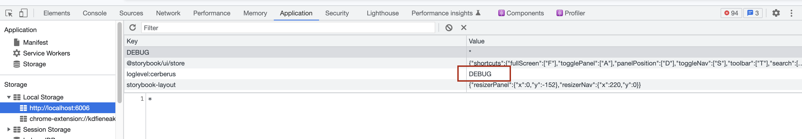
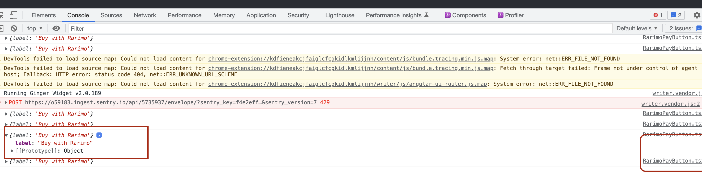

# nft-settlement-use-case

NFT Settlement flow allows marketplace users to make cross-chain NFT purchases without the extra manual steps. Our solution can accept practically any fungible token from our supported blockchains, using our unique bundling technology to minimize fees and increase transaction reliability.

## Installation

You can install this component with either `npm` or `yarn`:

```sh
npm install @rarimo/rarimo-settlement-component ethers
```

```sh
yarn add @rarimo/rarimo-settlement-component ethers
```

## Versioning

We use semantic versioning because, really, is there anything other option?

1. Check to make sure all the relevant files for the release is in `main` branch.
1. Create a new branch off of `main` locally, titled `release/v*.*.*`, and run `npm version [major|minor|patch]` on that branch (versions should be the same).
1. Push the branch and open a PR. This will run our tests on the planned release.
1. Once the PR passes the checks and is reviewed && approved, merge to `main`.
1. Once the `main` branch is done, create a new `tag` (with the same version as above) in Github. This will trigger our `Publish` action.
1. Once the `Publish` action is complete, verify that the new version is available in npm.
1. Crack open a fresh can of kombucha to celebrate.

## Quick Start

### Running locally (Temporary untill we decide if we want to have a separate repo for internal developement):

1. RUN `yarn storybook`
2. go to `http://localhost:6006/`
3. Click on `Buy` in Left hand menu›

### Lint :

1. run `yarn lint` to look for lint issues in the code
2. run `yarn lint fix` to fix the lint issues (just like real life, not all issues are auto fixable)

### Debugging and logging :

This lib uses loglevel for logging to help with debugging. Steps to debug are as follows

1. Load compoenent in the browser in any react app
2. Open chrome developer tools
3. Click on `Application`
4. Go to `Storage => Local Storage => localhost`
5. You would see the key `loglevel:cerberus` which is defaulted with `INFO`, in this mode all logs logged with `info` will be displayed in console.
   

Screenshot 2022-09-01 at 2.43.11 PM.png

6. Change this value to `DEBUG` to see the logs displayed in debug level
7. Level which can be used for logging are
   TRACE: 0
   DEBUG: 1
   INFO: 2
   WARN: 3
   ERROR: 4
   SILENT: 5

8. Depending on the level you would be able to see the logs in console
   
